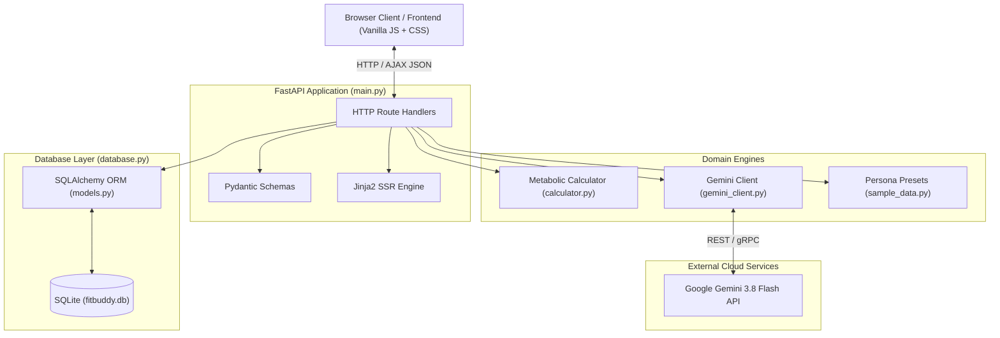
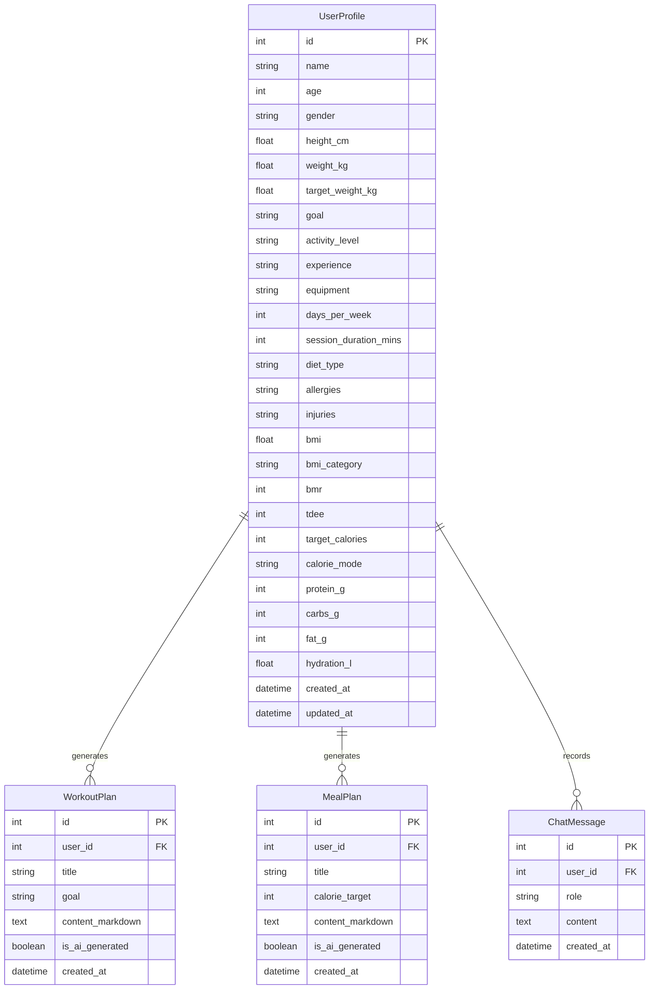

# 🏛️ FitBuddy: Architecture & Database Models

This document outlines the software architecture, entity relationships, and schema definitions of **FitBuddy**.

---

## 1. System Architecture Diagram

---

## 2. Relational Database Schema & Models

The SQLite database (`fitbuddy.db`) is managed via SQLAlchemy declarative models in [`models.py`](file:///c:/Users/ADMIN/.gemini/antigravity-ide/scratch/fitbuddy/models.py).

### Entity Relationship Diagram (ERD)

---

## 3. Schema Fields Breakdown

### 1. `user_profiles` Table
| Column | Type | Constraints | Description |
| :--- | :--- | :--- | :--- |
| `id` | `INTEGER` | Primary Key, Indexed | Unique profile identifier |
| `name` | `VARCHAR(100)` | Default: 'Athlete' | User's display name |
| `age` | `INTEGER` | Default: 28 | Age in years |
| `gender` | `VARCHAR(20)` | Default: 'Male' | Biological sex for metabolic formulas |
| `height_cm` | `FLOAT` | Default: 178.0 | Stature in centimeters |
| `weight_kg` | `FLOAT` | Default: 85.0 | Current body weight in kilograms |
| `target_weight_kg`| `FLOAT` | Default: 75.0 | Target weight goal in kilograms |
| `goal` | `VARCHAR(100)` | Default: 'Fat Loss' | Fitness objective |
| `activity_level` | `VARCHAR(100)` | Default: 'Moderately Active'| Daily activity rating |
| `experience` | `VARCHAR(50)` | Default: 'Intermediate' | Training background |
| `equipment` | `VARCHAR(100)` | Default: 'Full Gym Access' | Available workout apparatus |
| `days_per_week` | `INTEGER` | Default: 4 | Target weekly training frequency |
| `session_duration_mins` | `INTEGER` | Default: 45 | Session length in minutes |
| `diet_type` | `VARCHAR(100)` | Default: 'High Protein' | Nutrition preference |
| `allergies` | `VARCHAR(255)` | Default: 'None' | Dietary dislikes and allergies |
| `injuries` | `VARCHAR(255)` | Default: 'None' | Physical safeguards and joint limits |
| `bmi` | `FLOAT` | Computed | Calculated Body Mass Index |
| `bmi_category` | `VARCHAR(50)` | Computed | WHO category (Normal, Overweight, etc.) |
| `bmr` | `INTEGER` | Computed | Basal Metabolic Rate (kcal) |
| `tdee` | `INTEGER` | Computed | Total Daily Energy Expenditure (kcal) |
| `target_calories`| `INTEGER` | Computed | Daily caloric budget (kcal) |
| `calorie_mode` | `VARCHAR(50)` | Computed | Deficit, Surplus, or Maintenance |
| `protein_g` | `INTEGER` | Computed | Daily target protein in grams |
| `carbs_g` | `INTEGER` | Computed | Daily target carbohydrates in grams |
| `fat_g` | `INTEGER` | Computed | Daily target dietary fat in grams |
| `hydration_l` | `FLOAT` | Computed | Minimum daily water target in Liters |
| `created_at` | `DATETIME` | Default: UTC now | Initial record timestamp |
| `updated_at` | `DATETIME` | OnUpdate: UTC now | Last modification timestamp |

---

### 2. `workout_plans` Table
| Column | Type | Constraints | Description |
| :--- | :--- | :--- | :--- |
| `id` | `INTEGER` | Primary Key, Indexed | Unique routine identifier |
| `user_id` | `INTEGER` | Foreign Key (`user_profiles.id`) | Owning user profile |
| `title` | `VARCHAR(200)` | Default: 'Training Split' | Plan headline |
| `goal` | `VARCHAR(100)` | Default: 'General Fitness' | Objective the plan addresses |
| `content_markdown`| `TEXT` | Not Null | Structured Markdown text of the workout |
| `is_ai_generated` | `BOOLEAN`| Default: False | True if generated via Gemini, False if demo |
| `created_at` | `DATETIME` | Default: UTC now | Generation timestamp |

---

### 3. `meal_plans` Table
| Column | Type | Constraints | Description |
| :--- | :--- | :--- | :--- |
| `id` | `INTEGER` | Primary Key, Indexed | Unique meal plan identifier |
| `user_id` | `INTEGER` | Foreign Key (`user_profiles.id`) | Owning user profile |
| `title` | `VARCHAR(200)` | Default: 'Macro Blueprint' | Blueprint headline |
| `calorie_target` | `INTEGER` | Default: 2000 | Daily target calorie goal |
| `content_markdown`| `TEXT` | Not Null | Structured Markdown text of meals and grocery list |
| `is_ai_generated` | `BOOLEAN`| Default: False | True if generated via Gemini, False if demo |
| `created_at` | `DATETIME` | Default: UTC now | Generation timestamp |

---

### 4. `chat_messages` Table
| Column | Type | Constraints | Description |
| :--- | :--- | :--- | :--- |
| `id` | `INTEGER` | Primary Key, Indexed | Unique message identifier |
| `user_id` | `INTEGER` | Foreign Key (`user_profiles.id`) | Owning user profile |
| `role` | `VARCHAR(20)` | Not Null ('user'/'assistant') | Sender identifier |
| `content` | `TEXT` | Not Null | Conversational message content |
| `created_at` | `DATETIME` | Default: UTC now | Message timestamp |
